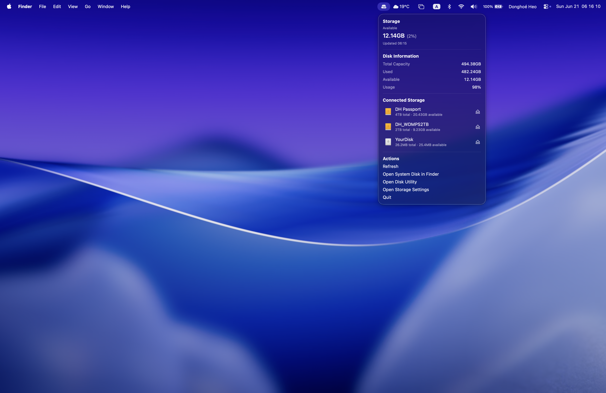
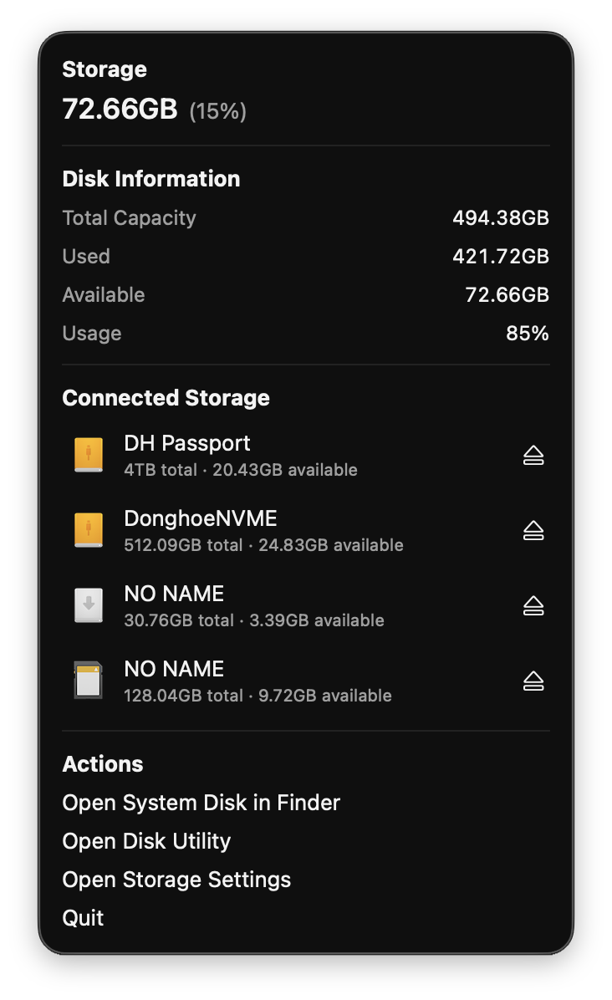
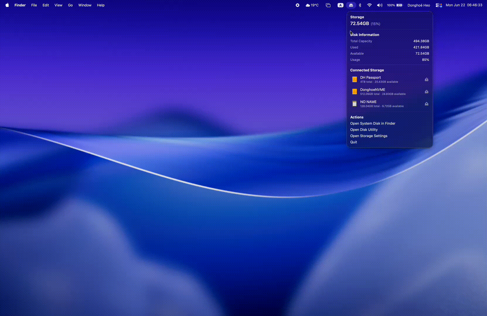

# 💾 yourdisk for macOS
macOS 메뉴바에서 작동하는 저장공간 및 외부 저장장치를 실시간으로 확인하고 관리하세요.

  

불필요한 요소를 최소화하고, macOS 기본 기능처럼 자연스럽고 직관적인 사용자 경험을 제공하도록 디자인했습니다.
별도의 창(UI) 없이 메뉴바에서 동작하며, 메뉴바 아이콘을 클릭하면 저장 공간 정보와 연결된 외부 저장장치를 한눈에 확인할 수 있습니다.

👉 **Latest Version**
https://github.com/ehdghl12/yourdisk-for-macOS/releases/latest/download/yourdisk.dmg

##

  

### Storage
- 현재 시스템 디스크의 남은 저장 공간을 실시간으로 확인할 수 있습니다.
- 남은 용량과 사용률을 한눈에 확인할 수 있습니다.

### Disk Information
- 시스템 디스크의 전체 용량, 사용 용량, 남은 용량 및 사용률을 확인할 수 있습니다.

### Connected Storage
- 현재 연결된 외부 저장장치를 자동으로 감지하여 표시합니다.
- 각 저장장치의 전체 용량과 남은 용량을 확인할 수 있습니다.
- 저장장치를 클릭하여 Finder에서 바로 열 수 있습니다.
- 메뉴에서 바로 안전하게 추출(Eject)할 수 있습니다.

### Actions
- **Refresh** : 저장 공간 정보를 수동으로 새로고침합니다. (기본적으로는 실시간으로 자동 갱신됩니다.)
- **Open System Disk in Finder** : 시스템 디스크를 Finder에서 엽니다.
- **Open Disk Utility** : 디스크 유틸리티를 실행합니다.
- **Open Storage Settings** : macOS 저장 공간 설정을 엽니다.
- **Quit** : YourDisk를 종료합니다.

## 

  

